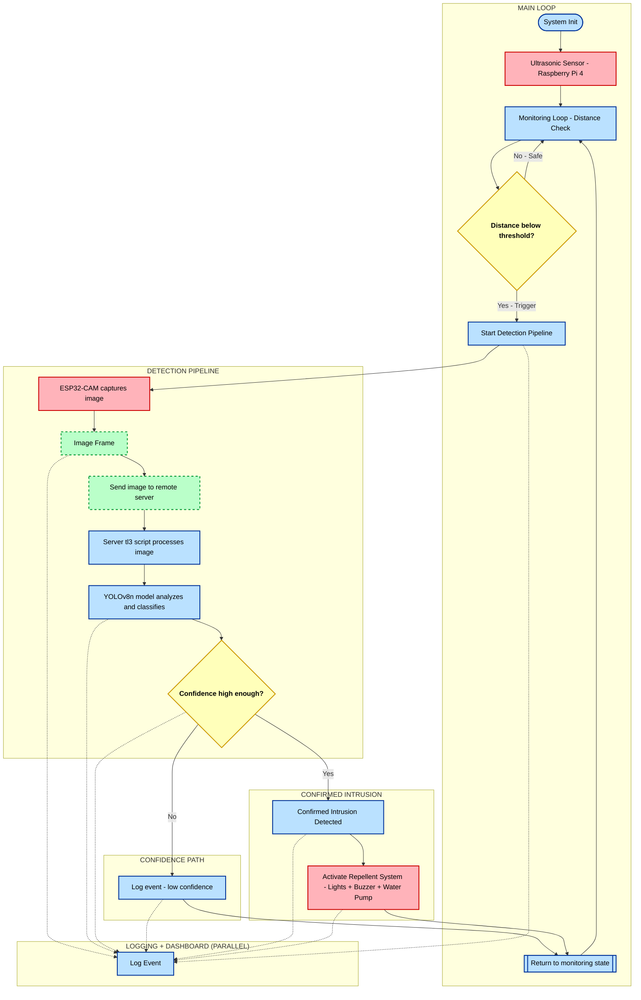

# Smart Farm Intrusion Detection System

A real-time animal intrusion detection and deterrence system for smart farming applications using ultrasonic sensors, ESP32-CAM, and YOLOv8n object detection with live web monitoring.

## Overview

This system provides automated wildlife intrusion detection and non-lethal repellent mechanisms to protect crops and livestock. The system uses a distributed architecture with edge computing on Raspberry Pi 4 and centralized AI processing on a remote server, with real-time monitoring available through a web dashboard.

## System Architecture

### Hardware Components
- **Raspberry Pi 4**: Edge device for sensor monitoring and local control
- **ESP32-CAM**: Camera module for visual detection
- **Ultrasonic Sensor**: Distance measurement for proximity detection
- **Repellent Actuators**:
  - High-intensity lights
  - Buzzer
  - Water pump system

### Software Components
- **ultrasonic.py** (Raspberry Pi 4): Monitors ultrasonic sensor and triggers detection pipeline
- **tl3.py** (Remote Server): Processes detection requests using YOLOv8n model
- **YOLOv8n**: Lightweight object detection model for animal classification
- **Web Dashboard**: Real-time monitoring interface hosted at **[Smart Farm UI](https://tinkering2k25.web.app/)**

## Features

- ✅ Real-time distance monitoring using ultrasonic sensors
- ✅ Automated intrusion detection based on proximity thresholds
- ✅ AI-powered animal classification using YOLOv8n
- ✅ Multi-stage non-lethal deterrent system (lights, sound, water)
- ✅ Remote processing for resource-intensive AI operations
- ✅ Live web dashboard with real-time statistics
- ✅ WebSocket-based log streaming
- ✅ Historical data visualization and analytics
- ✅ Modular and scalable architecture

## System Workflow

1. **Proximity Detection**: Ultrasonic sensor continuously measures distance
2. **Threshold Trigger**: When animal reaches critical distance, system activates
3. **Visual Verification**: ESP32-CAM captures image for analysis
4. **AI Classification**: Server processes image using YOLOv8n model
5. **Deterrent Activation**: Based on detection confidence, repellents are deployed
6. **Real-time Logging**: All events streamed to web dashboard via WebSocket
7. **Data Analytics**: System aggregates statistics for trend analysis
8. **Monitoring**: System logs events and returns to monitoring state

## Web Dashboard

### 🌐 Access the Live Dashboard
**URL**: [Smart Farm UI](https://tinkering2k25.web.app/)

The web dashboard provides:
- **Real-Time Monitoring**: Live system status, sensor readings, and detection alerts
- **Log Streaming**: Real-time log viewer with filtering and search
- **Analytics**: species distribution
- **System Controls**: Automatic deterrent triggers and configuration updates
- **Live Camera Feed**: ESP32-CAM video stream integration

## Installation

### Prerequisites

**Raspberry Pi 4:**
```bash
Python 3.7+
RPi.GPIO library
```

**Remote Server:**
```bash
Python 3.8+
PyTorch
Ultralytics YOLOv8
```

### Setup

**1. Clone the repository:**
```bash
git clone https://github.com/shlok165/smart-farm-intrusion-detection/
cd smart-farm-intrusion-detection
```

**2. Install dependencies:**

On Raspberry Pi:
```bash
pip install -r requirements.txt
```

On Remote Server:
```bash
pip install ultralytics torch torchvision
```

## Configuration

### ⚠️ Important: Update IP Addresses

**Before running the system, you must update the server IP address.**

**In `ultrasonic.py`:**
```python
# Update SERVER_IP with your remote server address
SERVER_IP = "YOUR_SERVER_IP_HERE"  # e.g., "192.168.1.100"
SERVER_PORT = 5000
```

**In `tl3.py`:**
```python
# Update HOST if needed
HOST = "0.0.0.0"  # Listen on all interfaces
PORT = 5000
```

### Optional: Sensor Calibration

Adjust detection threshold in `ultrasonic.py`:
```python
DETECTION_THRESHOLD = 50  # Distance in cm
```

## Usage

### Running the System

The system requires only **2 Python files** to run:

**1. Start the remote server (tl3.py):**
```bash
python tl3.py
```
This starts the AI detection server with YOLOv8n model.

**2. Start the Raspberry Pi sensor (ultrasonic.py):**
```bash
python ultrasonic.py
```
This starts the ultrasonic sensor monitoring and detection system.

**3. Access the web dashboard:**
Open your browser and navigate to:
```
[Dashboard](https://tinkering2k25.web.app/)
```

That's it! The system is now running and monitoring for intrusions.

## System Demonstration



### 📹 Video Demo

https://github.com/user-attachments/assets/fd8d4a48-32a9-47ed-b877-3ac7bbdd3d34

## Troubleshooting

### Connection Issues
- Verify server IP address is correctly configured in `ultrasonic.py`
- Check firewall settings on remote server (port 5000 should be open)
- Ensure both devices are on the same network or have proper routing

### Camera Not Detected
- Verify ESP32-CAM is powered and connected
- Check camera stream URL in configuration
- Test camera feed independently

### Detection Issues
- Calibrate ultrasonic sensor distance threshold
- Verify YOLOv8n model is properly loaded on server
- Check lighting conditions for camera detection

### Web Dashboard Connection
- Verify you can access the dashboard URL
- Check browser console for errors
- Ensure WebSocket connection is established

## Performance Metrics

- **Detection Latency**: < 2 seconds (from trigger to classification)
- **Detection Accuracy**: ~85-95% (YOLOv8n dependent)
- **False Positive Rate**: < 10% with proper calibration
- **Range**: Up to 4 meters (ultrasonic sensor dependent)
- **Dashboard Update Latency**: < 100ms for real-time logs

## Non-Lethal Deterrent Strategy

The system employs a graduated response:

**Visual Deterrent**: High-intensity LED lights activate to startle animals
**Acoustic Deterrent**: Buzzer emits loud sounds to discourage approach
**Physical Deterrent**: Water pump sprays harmless water jet

All deterrents are designed to be completely harmless while effectively discouraging intrusion.

## Future Enhancements

- [ ] Multi-camera support for wider coverage
- [ ] SMS/Email alert notifications
- [ ] Mobile app for remote monitoring
- [ ] Machine learning model retraining pipeline
- [ ] Advanced AI models for species-specific detection
- [ ] Solar power integration
- [ ] Weather API integration for context-aware detection

## Contributing

Contributions are welcome! Please fork the repository and submit a pull request with your improvements.

## License

This project is licensed under the MIT License - see the LICENSE file for details.

## Support

For issues, questions, or suggestions, please open an issue on GitHub or contact the maintainer.

## Acknowledgments

- YOLOv8 by Ultralytics
- Raspberry Pi Foundation
- ESP32 community

